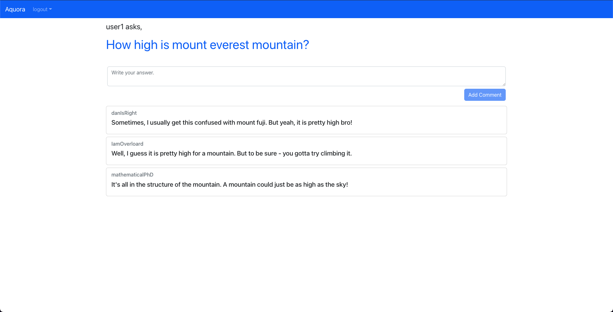

# Q & A Site With ML

An attempt to clone Quora's similar questions ML capability.
A question-answer platform where users can ask questions and get answers from other users.

## Screenshots

Similar Questions shown when adding a new question. (This section comes under dashboard and requires a user login)

Login as a user

Register an account

Dashboard that is visible after a successful login

Question format expectations when asking a question

Viewing an already asked question

## Developer Setup

### Requirements
- Python 3.7.9
- Node v14.16.0
- Docker & docker-compose
- vocab file. Download 
[here](https://drive.google.com/file/d/122qj6k7x_F56_znlhgeveZsXFnlnb2yv/view?usp=sharing). Then place it within 
`Backend/model_api/model/`

### Pre-setup
Setup the basic backend db
- Go to `Backend` directory and run docker-compose

  `docker-compose -f docker-compose.dev.yaml up -d`

### Backend - Common
- Move to `Backend` directory
- Add virtual environment using

  `python -m venv env`
- Activate virtual environment [how-to-activate](https://docs.python.org/3/tutorial/venv.html) - this depends on OS
- Install project dependencies

  `pip install -r requirements.txt`

- Create a `.env` file at the root of the Backend folder using the contents of `.env.sample` file.

### Backend - ML API (Flask)
- Move to `Backend\model_api\` directory
- (Optional) To add hot-reloading, Add environment variable by running

  `export FLASK_DEBUG=1`

  `export FLASK_APP=app.py`
- Run the app

  `python app.py`

### Backend - Django
- Move to `Backend` directory
- Run migrations

  `python manage.py migrate`
- Start the app

  `python manage.py runserver`

### Frontend
- Move to `frontend` directory
- Install node dependencies 
  
  `npm -i`
- Start the node application

  `npm start`
